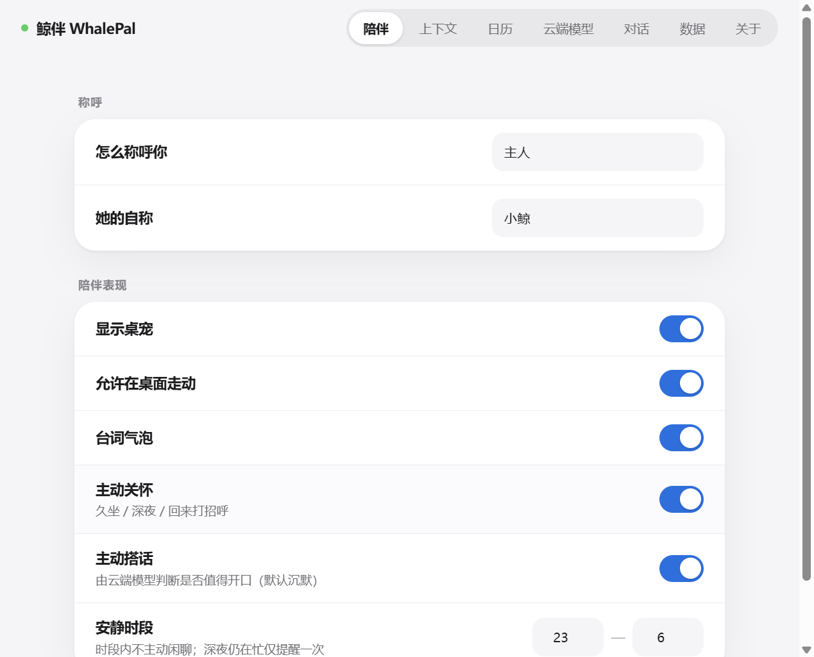
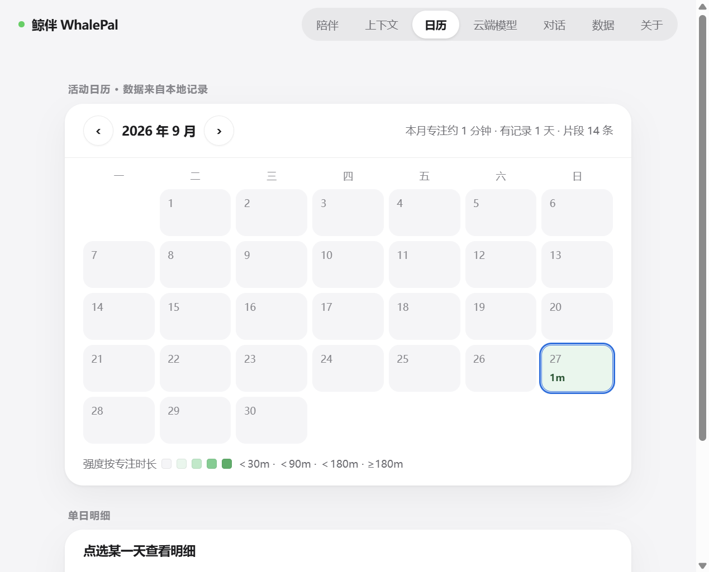
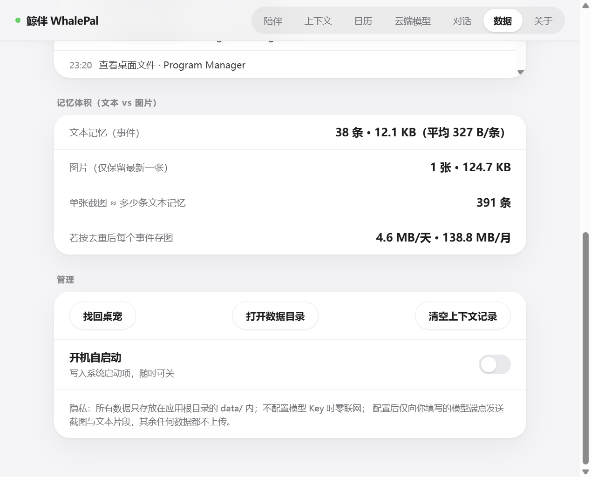

<div align="center">

# 🐋 鲸伴 WhalePal

**一只住在你桌面、安静陪着你、并且「看得懂你在忙什么」的鲸鱼伙伴。**

*A desktop whale-girl companion that understands what you're working on —
cloud vision for understanding, local-only data, zero telemetry.*

[](LICENSE)
[](#开发与测试)
[](#快速开始)
[](docs/11-隐私与数据流.md)


</div>

## 这是什么

**鲸伴 = MineContext 的「理解」 × 鲸鱼娘的「陪伴」。**

她是一个独立的 Windows 桌面应用：一条透明置顶的鲸鱼桌宠待在屏幕角落，可以拖拽、摸头、投喂；
背后的上下文引擎周期性地「看」屏幕（画面有变化时才分析），用**云端多模态模型**理解你正在做什么，
据此切换状态、主动关心，并能回答「我刚才在干嘛」「今天做了什么」。

她默认安静：不漫游、不刷屏、工作时不插嘴；所有数据只存在应用自己的文件夹里。

## 她能做什么

- 🐋 **陪伴**：原地待机小动作（喝咖啡/伸懒腰/摸鱼，每 45–110 秒一次）、偶尔轻轻起伏一下、摸头/戳肚子/戳尾巴、三连击彩蛋、右键菜单（让她说一句/投喂/夸夸/今日摘要/看日历）、拖拽惯性甩动、3 分钟无互动原地打盹。
- ⚡ **轻量**：待机不做常驻 60fps 动画（那是透明置顶窗口空转的大头），实测空转 CPU ≈1%（24 核本机，改前 28–64%）；只有拖拽甩动、走动开启时才逐帧。
- 👀 **理解**：周期截屏 → 感知哈希去重 → 云端多模态理解；姿势跟着内容走——写代码→调试、开会→会议、部署→发布，同组内按 4 分钟缓慢轮换；屏幕报错→沮丧反应、任务完成→庆祝。
- 💬 **交流**：台词（摸头/投喂/关怀/报错反应/问候）**全部由云端模型结合当下情境现写**，内置台词库只在没配 Key / 断网时兜底；
  结合分层记忆（对话 / 每日摘要 / 事件明细 / 跨天实体）回答你的问题；问「现在」时会现场截一张图给模型看。
- 🗓️ **回顾**：日历热力图（按专注时长五档强度）、单日时间线、按天摘要（过去日期生成一次后缓存）。
- 🛡️ **隐私**：不配置模型 Key 时零联网；配置后只有你填写的端点能收到数据（截图只在「画面变化的理解」与「现在类提问」两个时刻发送）；唯一网络出口在代码层做了白名单校验。

## 和 DeepSeek Harness（DSH）的关系

仓库里的 [`packages/dsh-bridge`](packages/dsh-bridge) 是一个**真的 DSH 插件**（`dsh.bundle` + `cordis.patch.yml` + 宿主侧 `apply(ctx)`），
装上之后 DSH 会把 agent 的真实状态（思考 / 在跑哪个工具 / 报错 / 回合结束 / 等你在界面上点确认）
通过 **127.0.0.1** 推给桌面上的鲸伴——她就不用靠截屏猜了。DSH 没开时鲸伴照常用，两者互不依赖。

```sh
dsh plugin --profile web add dsh-whalepal-bridge
# 或从本仓库直接装：dsh plugin --profile web add github:Jessie-1939/whalepal#path:/packages/dsh-bridge
```

插件只往回环地址发（非回环地址一律拒绝）、不读消息内容、无遥测；鲸伴侧在 设置 → 陪伴 → 「DSH 桥接」里可随时关闭。

### 让 AI 帮你装（把下面这段直接丢给你的 agent）

> 把 https://github.com/Jessie-1939/whalepal 里的 **`packages/dsh-bridge` 子包**装成 DSH 插件：
> 1. 找到 DSH profile 目录（默认 `~/.dsh/profiles/web`）；
> 2. 在该目录执行 `pnpm add "github:Jessie-1939/whalepal#path:/packages/dsh-bridge"`；
> 3. 确认该目录 `package.json` 的 `dsh.profile.bundles` 里出现 `dsh-whalepal-bridge`
>    （没有的话再跑一次 `dsh plugin --profile web ls` 触发对账）；
> 4. 用 `dsh --profile web --dump-config` 确认配置树里有 `whalepal-bridge`，然后重启 `dsh web`。
>
> ⚠️ 注意：这是一个 monorepo，**要装的是 `packages/dsh-bridge` 子包，不是仓库根目录的 Electron 应用**；
> Windows 下不要用官方 `dsh plugin add` 直接传带空格的本地路径（CLI 转发给 pnpm 时会被拆成两个包），用上面的 git 规格最稳。

## 截图

| 陪伴设置 | 活动日历 |
| --- | --- |
|  |  |

| 主动搭话（手动触发） | 隐私与记忆体积 |
| --- | --- |
|  |  |

## 快速开始

```powershell
git clone https://github.com/Jessie-1939/whalepal.git
cd whalepal
npm install
npm start          # 或者：装完依赖后直接双击 启动鲸伴.vbs（无命令行窗口）
```

**开箱即用**：立绘素材（60+ 张）随仓库提交，无需额外下载；不填 API Key 也能完整运行（基础感知 / 关怀 / 日历 / 模板问答），填了 Key 才启用云端理解。

需要 **Node.js 20+**（建议 22 LTS）。想验证依赖装好了没：`npm test`（应输出 80+ 个用例全过）。
Windows 想要桌面图标和开机自启：`powershell -ExecutionPolicy Bypass -File scripts/create-desktop-shortcut.ps1`。

<details>
<summary><b>常见问题</b>（都是实际踩过的坑）</summary>

- Electron 下载慢或失败（中国大陆常见）：
  `$env:ELECTRON_MIRROR='https://npmmirror.com/mirrors/electron/'; npm install`
- npm 11 提示 install scripts 被 allow-scripts 拦截（Electron 二进制没装成）：
  `node node_modules/electron/install.js`（可先设上面的镜像环境变量）。
- git 报 dubious ownership：`git config --global --add safe.directory <仓库路径>`。
- 找不到桌宠：右键托盘图标 → 显示，或 设置 → 数据 → 找回桌宠。

</details>

## 配置云端模型

设置 → 云端模型，内置预设一键切换（模型分析全部在云端完成，本应用不运行本地模型）：

| 预设 | 说明 |
| --- | --- |
| 阿里云百炼（Qwen） | 默认预设，`qwen3.8-omni-flash`（OpenAI 兼容模式，已默认关闭思考模式：单次约 1 秒） |
| Doubao（火山方舟） | `doubao-seed-1-6-flash` 系列 |
| OpenAI | `gpt-4o-mini` 等 |
| 自定义 | 任意 OpenAI 兼容端点（含本地网关，http 仅允许 localhost） |

API Key 只保存在本机 `data/config.json`（被 git 忽略，界面不回显）。

## 隐私承诺（硬保证）

1. **所有数据只落在 `<应用目录>/data/`**：配置、事件、摘要、对话、养成、截图、缓存、日志——不写系统图片 / 文档 / AppData。
2. **不配置 Key 时零联网**：截屏、去重、基础感知、关怀、日历、模板问答全部本地完成。
3. **唯一网络出口 = 你填写的那一个模型端点**：代码层白名单（`src/main/context/net.js`），任何第三方地址的请求直接拒绝；Chromium 后台联网 / 组件更新 / 崩溃上报已关闭；无遥测、无自动更新。

推送前自检：`npm run privacy`（扫描当前文件 + 全部提交历史中的密钥 / 个人路径 / 专属域名）。细节见 [docs/11-隐私与数据流.md](docs/11-隐私与数据流.md)。

## 上下文是怎么设计的

- **长期记忆是文本**：L0 对话 → L1 每日摘要 → L2 事件明细（含驻留时长）；可检索、可再压缩、召回便宜。
- **跨天实体记忆**：最近 7 天的项目 / 文件 / 主题由本地事件现算（不额外落盘），所以她答得出"你最近一直在做什么"。
- **她会开口**：每次理解屏幕后的观察会按节流说出来（工作中 8 分钟、其余 3 分钟一条），右键还可「让她说一句」。
- **像素只是原料**：只在「周期理解」与「现在类提问」两个时刻进入模型；默认仅保留最新一张截图。
- **一次理解吃干榨净**：每条事件含 `detail`（具体在做什么）+ `entities`（项目/文件名/关键词）+ `topics`，而不是几个字；
  截图之外还会附上一段**无障碍树文本摘录**（本机只读、不是 OCR、可关）作为精确文本提示。
- 实测基准（本机）：一张 1280×720 截图 ≈ 87–136 KB，一条事件 ≈ 323 B——按事件留存图片的代价约 124 MB/月，而文本记忆约 3 MB/月。

完整调研与决策（含 screenpipe / OpenAdapt / MineContext / OpenViking 对照）见
[docs/10-上下文设计.md](docs/10-上下文设计.md) 与 [docs/12-记忆介质决策.md](docs/12-记忆介质决策.md)。

## 技术栈与结构

Electron 37 · 原生 JS 渲染（无构建链）· 纯函数状态机 · JSONL/JSON 本地存储 · node:test ·
云端 OpenAI 兼容多模态接口（百炼 / 豆包 / OpenAI / 自定义）。

```
src/
├─ main/            主进程：窗口/托盘/IPC + context/（截屏、去重、分析、存储、关怀、问答、主动搭话）
├─ preload/         contextBridge 白名单
└─ renderer/
   ├─ core/         纯函数状态机、台词库、姿势映射（可单测）
   ├─ pet/          桌宠窗口 + assets/poses/<姿势>/ 立绘（12 个姿势组，60+ 张）
   └─ settings/     设置面板（Apple Liquid Glass 风格）
```

## 开发与测试

```powershell
npm test        # 52 项单元测试（状态机 / 感知哈希 / 分类器 / 姿势映射 / 日历 / 隐私出口）
npm run check   # 全量语法检查
npm run privacy # 推送前隐私审计（当前文件 + 全部历史）
npm run gif     # 由 data/gif-frames/ 的连续帧生成 README 动图
npm run dist    # 打包：dist/ 下产出 zip（绿色单文件夹）与 NSIS 安装包
```

自检开关（开发用）：
`WHALEPAL_SMOKE=1`（跑一次完整感知链路后退出）、
`WHALEPAL_DEBUG_CAPTURE=1`（打印窗口坐标并抓取桌宠/设置窗口）、
`WHALEPAL_DEBUG_PROACTIVE=1`（立即执行一次主动搭话判断）、
`WHALEPAL_DEBUG_FRAMES=16`（连续抓帧，供 `npm run gif` 使用）。

## 文档索引

| 文档 | 内容 |
| --- | --- |
| [docs/01-项目大纲.md](docs/01-项目大纲.md) | 项目定位、愿景、范围、成功标准 |
| [docs/02-需求规格.md](docs/02-需求规格.md) | 功能需求 FR-* 与非功能需求 NFR-* |
| [docs/03-系统架构.md](docs/03-系统架构.md) | 架构、模块职责、数据流、IPC、单文件夹布局 |
| [docs/04-技术选型与集成方案.md](docs/04-技术选型与集成方案.md) | 技术栈决策、融合映射、素材复用、成本模型 |
| [docs/05-桌宠交互与陪伴设计.md](docs/05-桌宠交互与陪伴设计.md) | 状态机、物理参数、互动、关怀、养成 |
| [docs/06-开发计划与里程碑.md](docs/06-开发计划与里程碑.md) | M0–M5 里程碑与任务清单 |
| [docs/07-验收标准.md](docs/07-验收标准.md) | 逐模块验收清单 |
| [docs/08-风险与架构决策.md](docs/08-风险与架构决策.md) | 风险登记与 ADR |
| [docs/09-实现约定变更.md](docs/09-实现约定变更.md) | 实现过程中的设计约定变更（1–12） |
| [docs/10-上下文设计.md](docs/10-上下文设计.md) | 分层上下文、图片 vs 文本、市面项目调研 |
| [docs/11-隐私与数据流.md](docs/11-隐私与数据流.md) | 隐私硬保证、出网清单、自查方法 |
| [docs/12-记忆介质决策.md](docs/12-记忆介质决策.md) | 为什么长期记忆用文本（本机实测） |
| [docs/13-主动搭话说明.md](docs/13-主动搭话说明.md) | 主动搭话门控与"为什么不说话" |

变更记录见 [CHANGELOG.md](CHANGELOG.md)。

## 路线图

- 🔊 语音陪伴（TTS/STT；参考 dsh-whale-pet 的语音播报思路）
- 🎞️ WebM 动画管线（95 个透明动画已调研，见 docs/04）
- 🖼️ 可选「关键帧存档」（1 张/小时、上限 200 张、默认关闭，见 docs/12）
- 🖥️ 多显示器支持改进、开机自启细化

## 致谢与许可

参考项目与署名见 [NOTICE](NOTICE)：MineContext（Apache-2.0，上下文管线/去重窗口/日历热力图思路）、
dsh-whale-musume（MIT，立绘素材与桌宠交互设计参考）、dsh-whale-pet ×2 与 dsh-maid-whale-suite（双形态/皮肤参考）。

本项目以 [MIT License](LICENSE) 开源；立绘素材按来源项目许可（MIT）使用并署名。
